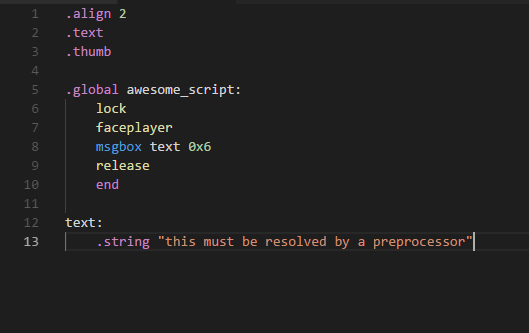

# Pokéscript Language Support for Visual Studio Code

Adds syntax highlighting for the Pokéscript language to Visual Studio Code. For an example macro definition for the pokéscript language you can use https://gist.github.com/SBird1337/0238742cdf606ae6fdec7587b063b30f, which this is currently compliant with. Currently only Syntax Highlighting is supported, but IntelliSense of some sort is planned.

Here is an example of how the Syntax Highlighting looks:

